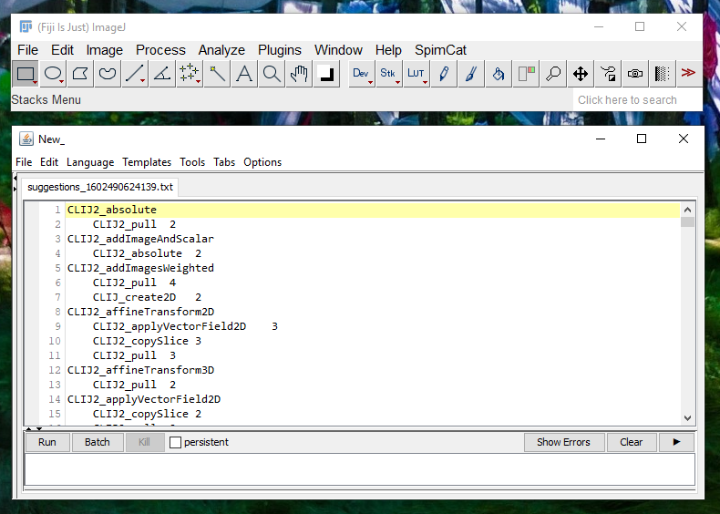

# CLIJx Usage Miner
Future [CLIJ](https://clij.github.io) will come with an [expert system](https://en.wikipedia.org/wiki/Expert_system) 
facilitating design of GPU-accelerated image analysis workflows. The underlying knowledge base will be built up by 
community contributions.

For extracting usage statistics from CLIJ users without collecting potentially confidental workflows they used, we 
set up this Fiji plugin, which parses a folder of ImageJ CLIJ Macros and extracts usage statistics from those scripts. 
For example, if a script contains a workflow applying thresholding and connected component labeling subsequently, 
the connection between these operations will be extracted, stored in a text file and can be submitted to the 
CLIJ developers. The process is 100%ly transparent. The users see what data is submitted and can also see how the 
information is extracted from their macros as the [CLIJx usage miner is open source](https://github.com/clij/usage-miner).

## How to extract usage statistics
Download and install [Fiji](https://fiji.sc/), activate the [CLIJ](https://clij.github.io/installation) update site 
and the download [CLIJx usage-miner plugin](https://github.com/clij/usage-miner/releases/download/0.1.0.1/clijx-usage-analyser_-0.1.0.1.jar) 
and put the jar file in the '/plugins/' directory of your Fiji.

Start Fiji, and execute the menu `Plugins > ImageJ on GPU (CLIJx) > Options > CLIJ Usage Miner`. Please select a folder
of imagej macros which use CLIJ. Such a file will open up:
 

Please submit this file via email to rhaase@mpi-cbg.de. By submitting the file you agree that this file may become part of future CLIJ 
releases shared under this [BSD3](https://github.com/clij/clij2/blob/master/license.txt) license. 
In exchange you will find your name in the list of contributors in the acknowledgements section of the [website](https://clij.github.io/) 
and the CLIJ expert system related publication. 
If you want your affiliation to be mentioned correctly, please specify it in the email.

Thanks for your contribution!

[Imprint](https://clij.github.io/imprint)
